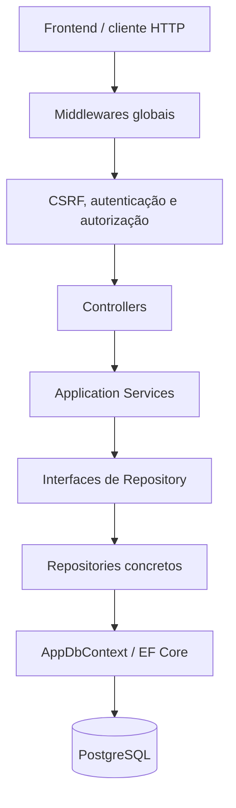

# Diagrama de arquitetura

```mermaid
flowchart TD
    Client[Frontend / cliente HTTP] --> MW[Middlewares globais]
    MW --> Auth[CSRF, autenticação e autorização]
    Auth --> Controllers[Controllers]
    Controllers --> Services[Application Services]
    Services --> Contracts[Interfaces de Repository]
    Contracts --> Repositories[Repositories concretos]
    Repositories --> EF[AppDbContext / EF Core]
    EF --> DB[(PostgreSQL)]
```
