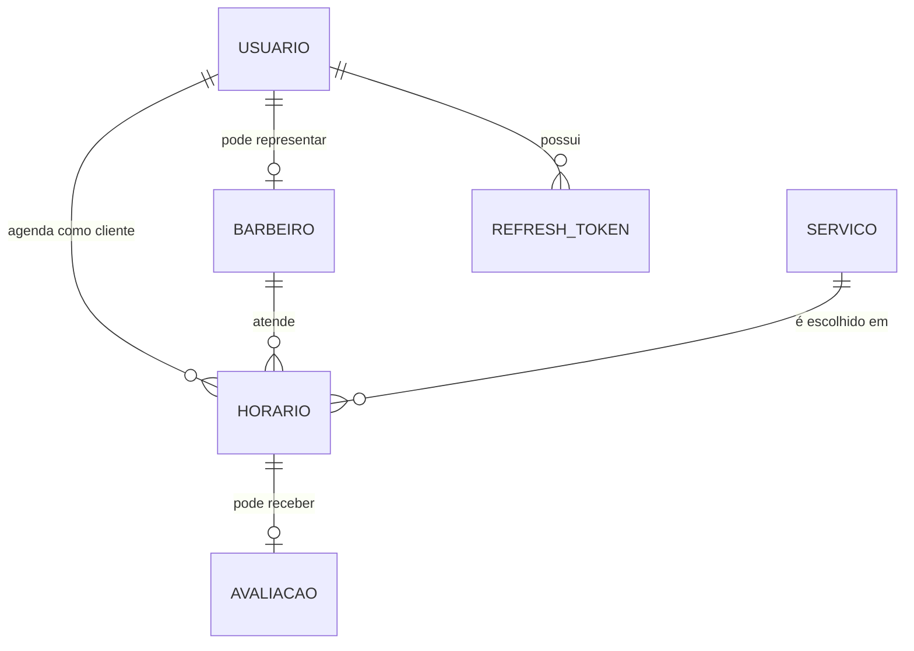

# Visão simplificada do domínio

O diagrama é conceitual e serve para navegação. Os detalhes definitivos de cardinalidade, chaves e nomes devem ser conferidos nas configurações EF Core e migrations.
