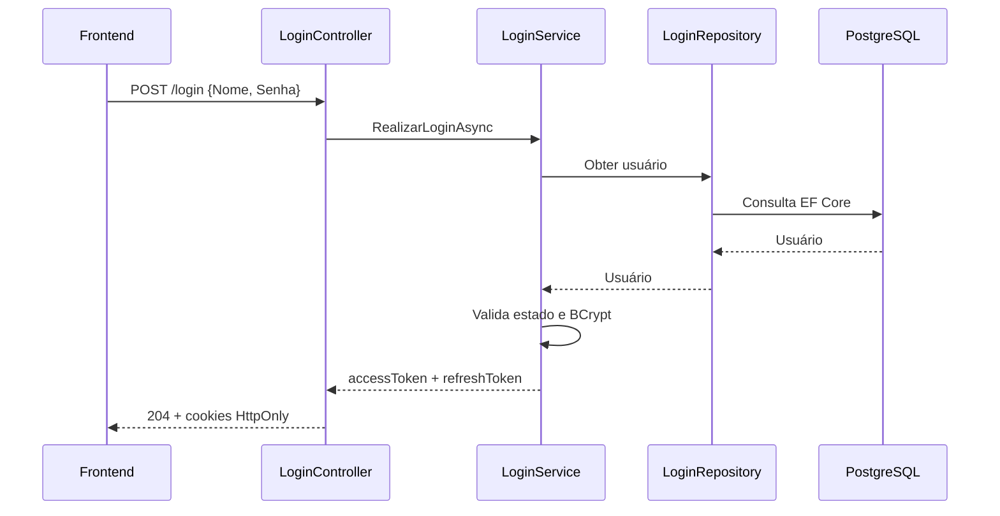

# Fluxo de login

```mermaid
sequenceDiagram
    participant F as Frontend
    participant C as LoginController
    participant S as LoginService
    participant R as LoginRepository
    participant DB as PostgreSQL

    F->>C: POST /login {Nome, Senha}
    C->>S: RealizarLoginAsync
    S->>R: Obter usuário
    R->>DB: Consulta EF Core
    DB-->>R: Usuário
    R-->>S: Usuário
    S->>S: Valida estado e BCrypt
    S-->>C: accessToken + refreshToken
    C-->>F: 204 + cookies HttpOnly
```
